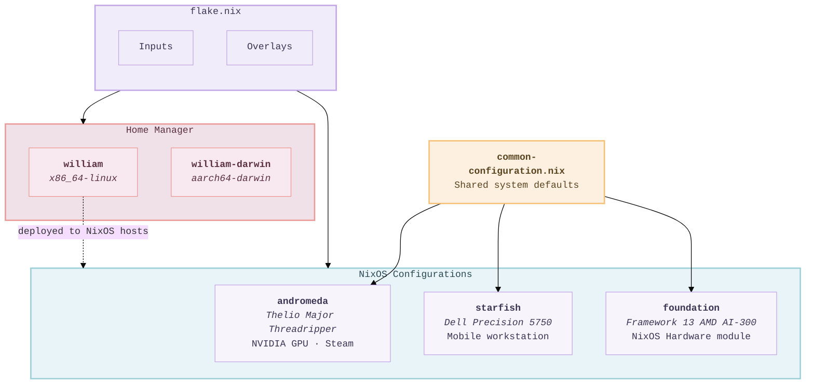

# dotfiles

NixOS configurations and Home Manager setup for multiple machines across Linux and macOS, managed as a single Nix flake. Everything from system-level services to shell aliases lives here, declaratively defined and reproducible.

## Architecture

The flake produces three NixOS system configurations and two Home Manager user configurations (Linux and macOS). All NixOS systems share a common base with host-specific overrides layered on top. The Home Manager configuration uses platform conditionals to work on both `x86_64-linux` and `aarch64-darwin`.



### Flake Inputs

| Input | Purpose |
|-------|---------|
| `nixpkgs-unstable` | Primary package source |
| `home-manager` | Declarative user environment |
| `nixos-hardware` | Hardware-specific modules (Framework laptop) |
| `pre-commit-hooks` | Git hook management |
| `sniffy` | AWS secrets scanner |
| `smailer` | S3 email viewer |
| `mux` | Tmux session manager |

## Repository Structure

```mermaid
%%{init: {'theme': 'base', 'themeVariables': { 'fontSize': '13px', 'fontFamily': 'JetBrains Mono, monospace' }}}%%
flowchart LR
    root["<b>~/.dotfiles</b>"]

    subgraph system_layer [" System Layer "]
        direction TB
        sys_common["common-configuration.nix<br/><i>Boot · Network · Audio<br/>Desktop · Services · Nix</i>"]
        sys_and["andromeda/<br/><i>NVIDIA · Steam</i>"]
        sys_star["starfish/<br/><i>Defaults</i>"]
        sys_found["foundation/<br/><i>Framework HW</i>"]
    end

    subgraph home_layer [" Home Manager Layer "]
        direction TB

        subgraph modules [" Nix Modules "]
            direction TB
            mod_pkg["packages.nix<br/><i>100+ packages</i>"]
            mod_shell["shells.nix<br/><i>Fish · Bash · aliases</i>"]
            mod_git["git.nix<br/><i>Delta · GPG signing</i>"]
            mod_tmux["tmux.nix<br/><i>Plugins · rose-pine</i>"]
            mod_gnome["gnome.nix<br/><i>Pop Shell · dconf</i>"]
            mod_prog["programs.nix<br/><i>Brave · direnv</i>"]
            mod_env["environment.nix<br/><i>Editor · pager · vars</i>"]
            mod_other["email · config · clawdbot"]
        end

        subgraph configs [" Dotfile Configs "]
            direction TB
            cfg_nvim["nvim/init.lua"]
            cfg_ghostty["ghostty/config + shaders"]
            cfg_tmuxinator["tmuxinator/*.yml"]
            cfg_bin["bin/ scripts"]
            cfg_other["gitignore · gitmessage<br/>pop-shell · gnome"]
        end
    end

    subgraph overlays_layer [" Overlays "]
        ovl_claude["claude-code 2.1.32"]
        ovl_other["variety · sniffy<br/>smailer · mux"]
    end

    root --> system_layer
    root --> home_layer
    root --> overlays_layer

    style root fill:#f0ecf9,stroke:#c4a7e7,stroke-width:2px,color:#3c3554
    style system_layer fill:#e8f4f8,stroke:#9ccfd8,stroke-width:2px,color:#2d4a54
    style home_layer fill:#fdf0e0,stroke:#f6c177,stroke-width:2px,color:#5a4520
    style overlays_layer fill:#f0e0e8,stroke:#ea9a97,stroke-width:2px,color:#5a3040
    style modules fill:#fdf5e8,stroke:#f6c177,stroke-width:1px,color:#5a4520
    style configs fill:#fdf5e8,stroke:#f6c177,stroke-width:1px,color:#5a4520
    style sys_common fill:#f0f8fb,stroke:#9ccfd8,color:#2d4a54
    style sys_and fill:#f0f8fb,stroke:#9ccfd8,color:#2d4a54
    style sys_star fill:#f0f8fb,stroke:#9ccfd8,color:#2d4a54
    style sys_found fill:#f0f8fb,stroke:#9ccfd8,color:#2d4a54
    style mod_pkg fill:#fef8f0,stroke:#f6c177,color:#5a4520
    style mod_shell fill:#fef8f0,stroke:#f6c177,color:#5a4520
    style mod_git fill:#fef8f0,stroke:#f6c177,color:#5a4520
    style mod_tmux fill:#fef8f0,stroke:#f6c177,color:#5a4520
    style mod_gnome fill:#fef8f0,stroke:#f6c177,color:#5a4520
    style mod_prog fill:#fef8f0,stroke:#f6c177,color:#5a4520
    style mod_env fill:#fef8f0,stroke:#f6c177,color:#5a4520
    style mod_other fill:#fef8f0,stroke:#f6c177,color:#5a4520
    style cfg_nvim fill:#fef8f0,stroke:#f6c177,color:#5a4520
    style cfg_ghostty fill:#fef8f0,stroke:#f6c177,color:#5a4520
    style cfg_tmuxinator fill:#fef8f0,stroke:#f6c177,color:#5a4520
    style cfg_bin fill:#fef8f0,stroke:#f6c177,color:#5a4520
    style cfg_other fill:#fef8f0,stroke:#f6c177,color:#5a4520
    style ovl_claude fill:#f8e8f0,stroke:#ea9a97,color:#5a3040
    style ovl_other fill:#f8e8f0,stroke:#ea9a97,color:#5a3040
```



## Hosts

### andromeda — Desktop Workstation

System76 Thelio Major with AMD Threadripper. Runs NVIDIA beta drivers with open source kernel modules and modesetting. Steam is enabled with firewall rules for local game transfers.

### starfish — Laptop

Dell Precision 5750. Inherits everything from the common configuration with no host-specific overrides.

### foundation — Travel Laptop

Framework 13 AMD AI-300 Series. Uses the `nixos-hardware` module for Framework-specific hardware support (power management, firmware, etc).

### Shared System Configuration

All hosts share `common-configuration.nix` which provides:

- **Boot:** systemd-boot with EFI support
- **Network:** NetworkManager, Avahi mDNS, Mullvad VPN, OpenSSH (key-only)
- **Desktop:** COSMIC greeter, X11, GNOME extensions (pop-shell, appindicator)
- **Audio:** PipeWire with PulseAudio compatibility
- **Services:** CUPS printing, Bluetooth, OpenSearch, GnuPG agent with SSH
- **Virtualisation:** Docker with host.docker.internal resolution
- **Fonts:** JetBrains Mono, Nerd Fonts, Fira Code
- **Nix:** Flakes enabled, weekly garbage collection, auto-optimise store
- **Locale:** en_GB.UTF-8, Europe/London timezone

## Home Manager

The user configuration is split into focused modules that are composed in `home/user/default.nix`.

### Packages

Over 100 packages organised by purpose. Linux-only packages (GUI apps, clipboard tools, system tracers) are conditionally included using `lib.optionals stdenv.isLinux`.

| Category | Packages | Platform |
|----------|----------|----------|
| **AI** | gemini-cli | All |
| **AI** | claude-code | Linux |
| **Desktop** | Brave, Chrome, Spotify, Slack, Telegram, LibreOffice, Variety | Linux |
| **Dev Tools** | gh, delta, lazydocker, dive, fzf, ripgrep, fd, jq, yq, httpie | All |
| **Networking** | nmap, mtr, doggo | All |
| **Networking** | tshark, bandwhich, iftop, nload | Linux |
| **Languages** | Node.js, Python 3, Ruby (YJIT), Go, Terraform, Lua | All |
| **LSP Servers** | nil, lua-language-server, gopls, ccls, bash-language-server, marksman, typescript-language-server | All |
| **Monitoring** | btop, htop | All |
| **Databases** | PostgreSQL, Valkey, pgcli | All |
| **Custom** | sniffy, smailer, mux | All |

### Shell

Fish is the default shell with extensive configuration:

- **Abbreviations** for navigation (`cdr`, `cdn`), Rails (`be`, `bx`, `rc`), Terraform (`tf`, `tfi`, `tfa`, `tfp`), Git, and AWS
- **Functions** for fetching `.gitignore` templates and managing dated notes
- **Zoxide** integration for fast directory jumping
- **Environment:** Neovim as editor/pager, YJIT-enabled Ruby, AWS eu-west-2 defaults

### Git

Signed commits with GPG key `BC6DED9479D436F5`. Delta as the diff viewer with the GitHub theme. Histogram diff algorithm, zdiff3 merge conflicts, auto-stash on rebase, and a commit template with JIRA format guidance. LFS enabled.

### Tmux

Rose Pine Moon theme. Vi key bindings, vim-tmux-navigator for seamless pane switching with `Alt+hjkl`, sessionx for fuzzy session management, thumbs for URL capturing, and yank for clipboard integration. Status bar at top. Tmuxinator session definitions for work, fun, and dotfiles projects.

### Desktop (Linux only)

GNOME with Pop Shell tiling. Six static workspaces with `Super+1-9` switching. Auto-move rules send Brave to workspace 1, Slack/Telegram/Discord to workspace 2, and Spotify/Clementine to workspace 3. Mouse focus-follows-pointer.

### Neovim

Single `init.lua` configuration. Leader key is comma. Key mappings include `jk` for escape, JIRA ticket insertion from branch names, and quickfix list toggling.

### Ghostty

JetBrains Mono font, Catppuccin Mocha theme, slight transparency, 10K line scrollback, and a collection of custom GLSL shaders.

## Overlays

Packages that need to diverge from nixpkgs-unstable are overlaid through the flake:

| Package | Source | Reason | Platform |
|---------|--------|--------|----------|
| `claude-code` | `overlays/claude-code/` | Pinned to 2.1.32 ahead of upstream | Linux |
| `sniffy`, `smailer`, `mux` | GitHub flake inputs | Personal tools | All |

## Custom Scripts

Located in `home/config/bin/` and added to `$PATH`:

| Script | Purpose |
|--------|---------|
| `ecs` | Interactive ECS task executor with fzf cluster/service/task selection |
| `notes` / `notes_on` | Fzf-based note browser and dated note creator with templates |
| `gcall` | Quick utility script |
| `gnome-dump` / `gnome-restore` | Backup and restore GNOME dconf settings |
| `brave-debug` | Launch Brave with remote debugging |
| `setup-claude-mcp` | Configure Claude Code MCP server connections |

## Usage

Rebuild a NixOS system:

```bash
sudo nixos-rebuild switch --flake .#andromeda   # desktop
sudo nixos-rebuild switch --flake .#starfish    # dell laptop
sudo nixos-rebuild switch --flake .#foundation  # framework laptop
```

Rebuild the Home Manager configuration:

```bash
home-manager switch --flake .#william          # Linux
home-manager switch --flake .#william-darwin   # macOS
```

Update all flake inputs:

```bash
nix flake update
```

## Pre-commit Hooks

Managed through `git-hooks.nix` and available in the dev shell (`nix develop`):

- **eclint** — EditorConfig validation
- **nil** — Nix language linting
- **ormolu** — Haskell formatting
- **end-of-file-fixer** — Ensure files end with a newline
- **trim-trailing-whitespace** — Clean up trailing spaces
