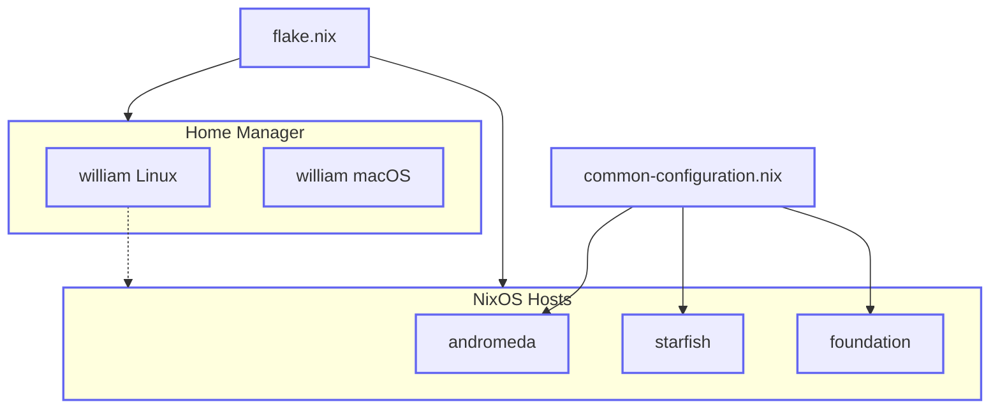
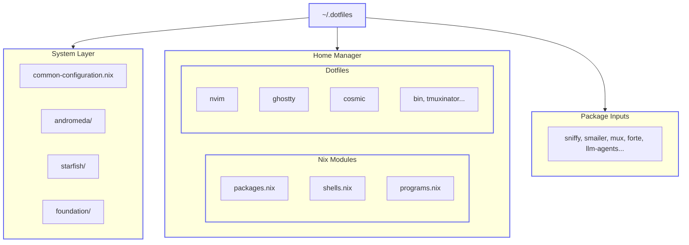

# dotfiles

NixOS configurations and Home Manager setup for multiple machines across Linux and macOS, managed as a single Nix flake. Everything from system-level services to shell aliases lives here, declaratively defined and reproducible.

## Architecture

The flake produces three NixOS system configurations and two Home Manager user configurations (Linux and macOS). All NixOS systems share a common base with host-specific overrides layered on top. The Home Manager configuration uses platform conditionals to work on both `x86_64-linux` and `aarch64-darwin`.


```mermaid
flowchart TD
    FLAKE[flake.nix]
    COMMON[common-configuration.nix]

    subgraph HOSTS [NixOS Hosts]
        ANDROMEDA[andromeda]
        STARFISH[starfish]
        FOUNDATION[foundation]
    end

    subgraph HM [Home Manager]
        HM_LINUX[william Linux]
        HM_DARWIN[william macOS]
    end

    FLAKE --> HOSTS
    FLAKE --> HM
    COMMON --> ANDROMEDA & STARFISH & FOUNDATION
    HM_LINUX -.-> HOSTS

    classDef box stroke:#6366f1,stroke-width:2px
    class FLAKE,COMMON,HOSTS,HM,ANDROMEDA,STARFISH,FOUNDATION,HM_LINUX,HM_DARWIN box
```

### Flake Inputs

| Input | Purpose |
|-------|---------|
| `nixpkgs` | Primary package source |
| `home-manager` | Declarative user environment |
| `nixos-hardware` | Hardware-specific modules (Framework laptop) |
| `flake-parts` | Composable flake structure and per-system outputs |
| `treefmt-nix` | Shared formatter/check wiring for `nix fmt` |
| `stylix` | Shared colour and font theming |
| `nix-index-database` | Prebuilt nix-index database and `comma` integration |
| `pre-commit-hooks` | Git hook management |
| `sniffy` | AWS secrets scanner |
| `smailer` | S3 email viewer |
| `mux` | Tmux session manager |
| `forte` | Desktop music player |
| `trade-tariff-tools` | ECS task management CLI |
| `llm-agents` | Grok, Codex, Claude Code, and Antigravity packages |

## Repository Structure


```mermaid
flowchart TD
    ROOT["~/.dotfiles"]

    subgraph SYSTEM [System Layer]
        COMMON[common-configuration.nix]
        ANDROMEDA[andromeda/]
        STARFISH[starfish/]
        FOUNDATION[foundation/]
    end

    subgraph HOME [Home Manager]
        subgraph MODULES [Nix Modules]
            PKGS[packages.nix]
            SHELLS[shells.nix]
            PROGRAMS[programs.nix]
        end
        subgraph CONFIGS [Dotfiles]
            NVIM[nvim]
            GHOSTTY[ghostty]
            COSMIC[cosmic]
            OTHER[bin, tmuxinator...]
        end
    end

    subgraph INPUTS [Package Inputs]
        TOOLS[sniffy, smailer, mux, forte, llm-agents...]
    end

    ROOT --> SYSTEM & HOME & INPUTS

    classDef box stroke:#6366f1,stroke-width:2px
    class ROOT,SYSTEM,HOME,INPUTS,MODULES,CONFIGS box
```

## Hosts

### andromeda - Desktop Workstation

System76 Thelio Major with AMD Threadripper and AMD graphics. Steam is enabled with firewall rules for local game transfers.

### starfish - Laptop

Dell Precision 5750. Inherits everything from the common configuration with no host-specific overrides.

### foundation - Travel Laptop

Framework 13 AMD AI-300 Series. Uses the `nixos-hardware` module for Framework-specific hardware support (power management, firmware, etc).

### Shared System Configuration

All hosts share `common-configuration.nix` which provides:

- **Boot:** systemd-boot with EFI support
- **Network:** NetworkManager, Avahi mDNS, Mullvad VPN, OpenSSH (key-only)
- **Desktop:** COSMIC desktop and greeter, X11
- **Audio:** PipeWire with PulseAudio compatibility
- **Services:** CUPS printing, Bluetooth, GnuPG agent with SSH
- **Virtualisation:** Docker with host.docker.internal resolution
- **Fonts:** JetBrains Mono, Nerd Fonts (JetBrains Mono, Ubuntu, Ubuntu Mono)
- **Nix:** Flakes enabled, weekly garbage collection, auto-optimise store
- **Locale:** en_GB.UTF-8, Europe/London timezone

## Home Manager

The user configuration is split into focused modules that are composed in `home/user/default.nix`.

### Packages

Over 100 packages organised by purpose. Platform-specific GUI apps, clipboard tools, and system tracers are conditionally included using `lib.optionals stdenv.isDarwin` / `lib.optionals stdenv.isLinux`.

| Category | Packages | Platform |
|----------|----------|----------|
| **AI** | antigravity, claude-code, codex, gemini-cli, grok | All |
| **Desktop** | AeroSpace, Brave, Ghostty, Slack, Spotify, Telegram | Darwin |
| **Desktop** | Brave, Chrome, Spotify, Slack, Telegram, LibreOffice, Variety | Linux |
| **Dev Tools** | gh, delta, lazydocker, dive, fzf, ripgrep, fd, jq, yq, httpie | All |
| **Networking** | nmap, mtr, doggo | All |
| **Networking** | tshark, bandwhich, iftop, nload | Linux |
| **Languages** | Node.js, Python 3, Ruby (YJIT), Go, Terraform, Lua | All |
| **LSP Servers** | nil, lua-language-server, gopls, ccls, bash-language-server, marksman, typescript-language-server | All |
| **Monitoring** | btop, htop | All |
| **Databases** | PostgreSQL, Valkey, pgcli | All |
| **Custom** | sniffy, smailer, mux, ecs | All |

### AI / LLM Agent Harness

The LLM harness is deliberately single-source: universal rules, job guides, and job-specific skills live once in `home/config/llm/` and Home Manager expands them into each tool's expected config directories.

- **Universal rules** live in `home/config/llm/AGENTS.md` and are deployed to:
  - `~/.grok/AGENTS.md`
  - `~/.claude/CLAUDE.md`
  - `~/.codex/AGENTS.md`
  - `~/.gemini/GEMINI.md`
  - `~/.agents/AGENTS.md`
  - Antigravity fallback paths under `~/.antigravity/` and `~/.antigravitycli/`

- **Job-specific guides** live in `home/config/llm/guides/` and are deployed to every supported guide root.

- **Shared job-specific skills** live in `home/config/llm/skills/` and are deployed to `~/.codex/skills/`, `~/.grok/skills/`, `~/.claude/skills/`, `~/.gemini/skills/`, `~/.agents/skills/`, and Antigravity fallback skill roots.

- **Process skills and reference library** live in `home/config/llm/process-skills/` and `home/config/llm/references/` and are deployed to tools that do not already provide equivalent native skills.

This keeps Grok CLI, Claude Code, Codex, Gemini CLI, and Antigravity aligned without maintaining separate skill copies.

### Hermes / Mem0

Hermes is currently managed outside this flake via Homebrew, but the repo keeps Qdrant support assets for Mem0-backed Hermes memory:

- `home/config/docker-compose/mem0-qdrant/` contains the Qdrant Compose setup, health check, start script, and one-off migration helper.
- Fish functions in `home/user/shells.nix` provide `mem0-qdrant-start`, `mem0-qdrant-logs`, and `mem0-status`.
- `home/user/mem0-qdrant.nix` is retained as a seed for later promoting Hermes/Qdrant into Home Manager.

### Shell

Fish is the default shell with extensive configuration:

- **Abbreviations** for navigation (`cdr`, `cdn`), Rails (`be`, `bx`, `rc`), Terraform (`tf`, `tfi`, `tfa`, `tfp`), Git, and AWS
- **Functions** for fetching `.gitignore` templates and managing dated notes
- **Zoxide** integration for fast directory jumping
- **Environment:** Neovim as editor/pager, YJIT-enabled Ruby, AWS eu-west-2 defaults

### Git

Signed commits with GPG key `BC6DED9479D436F5`. Delta as the diff viewer with the GitHub theme. Histogram diff algorithm, zdiff3 merge conflicts, auto-stash on rebase, and a commit template with JIRA format guidance. LFS enabled.

### Tmux

Rose Pine Moon theme. Vi key bindings, vim-tmux-navigator for seamless pane switching with `Alt+hjkl`, sessionx for fuzzy session management, thumbs for URL capturing, and yank for clipboard integration. Status bar at top. Tmuxinator session definitions for work, fun, and dotfiles projects.

### Desktop (Linux only)

COSMIC desktop with autotiling, focus-follows-cursor, and active window hints. Panel on the left (XS) with workspaces and status applets. Six static workspaces with `Super+1-9` switching. All settings managed declaratively via Home Manager.

### Neovim

Single `init.lua` configuration. Leader key is comma. Key mappings include `jk` for escape, JIRA ticket insertion from branch names, and quickfix list toggling.

Stylix owns Neovim's colour scheme through the shared Rose Pine Base16 palette. For this repository, Conform delegates formatting to `nix fmt` so save-on-format follows the same treefmt configuration as pre-commit and CI checks.

### Ghostty

JetBrains Mono font, Catppuccin Mocha theme, slight transparency, 10K line scrollback, and a collection of custom GLSL shaders.

## Package Inputs And Overlays

Personal tools and agent CLIs are exposed through flake inputs and package overlays:

| Package | Source | Reason | Platform |
|---------|--------|--------|----------|
| `antigravity`, `grok`, `codex`, `claude-code` | `llm-agents` flake input | Agent tooling | Mixed |
| `sniffy`, `smailer`, `mux`, `forte` | GitHub flake inputs | Personal tools | Mixed |
| `ecs` | `trade-tariff-tools` flake input | ECS task executor | All |

## Custom Scripts

Located in `home/config/bin/` and added to `$PATH`:

| Script | Purpose |
|--------|---------|
| `notes` / `notes_on` | Fzf-based note browser and dated note creator with templates |
| `gcall` | Nix garbage collection for user and root stores |

## Usage

Rebuild a NixOS system:

```bash
sudo nixos-rebuild switch --flake .#andromeda   # desktop
sudo nixos-rebuild switch --flake .#starfish    # dell laptop
sudo nixos-rebuild switch --flake .#foundation  # framework laptop
```

Rebuild the Home Manager configuration:

```bash
home-manager switch --flake .#william-linux    # Linux
home-manager switch --flake .#william-darwin   # macOS
```

Update all flake inputs:

```bash
nix flake update
```

Format and verify the repository:

```bash
nix fmt
nix flake check
```

`flake-parts` owns the per-system outputs in `flake.nix`, so new formatter, check, package, app, and dev shell outputs should usually be added under `perSystem`.

## Pre-commit Hooks

Managed inline in `flake.nix` through `git-hooks.nix` and available in the dev shell (`nix develop`). Formatting is intentionally centralised through treefmt: `nix fmt`, pre-commit, and Neovim all use the same formatter path for this repository.

- **actionlint** - GitHub Actions workflow linting
- **check-added-large-files** - Prevent unexpectedly large files from being committed
- **check-case-conflicts** - Detect filename case conflicts
- **check-json** - JSON syntax validation
- **check-merge-conflicts** - Detect unresolved merge conflict markers
- **check-yaml** - YAML syntax validation
- **deadnix** - Detect unused Nix code
- **detect-private-keys** - Prevent private keys from being committed
- **eclint** - EditorConfig validation
- **end-of-file-fixer** - Ensure files end with a newline
- **fish-syntax** - Fish script syntax validation for custom scripts
- **nil** - Nix language linting
- **treefmt** - Shared formatting for Nix, Lua, shell, Fish, JSON, and YAML
- **shellcheck** - Shell script linting
- **trim-trailing-whitespace** - Clean up trailing spaces
