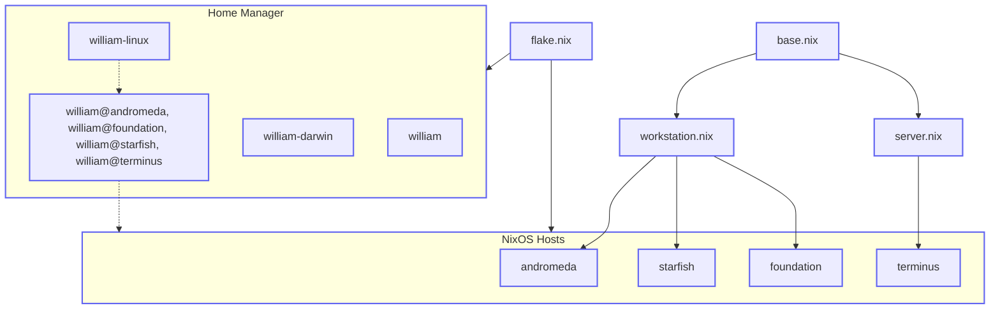
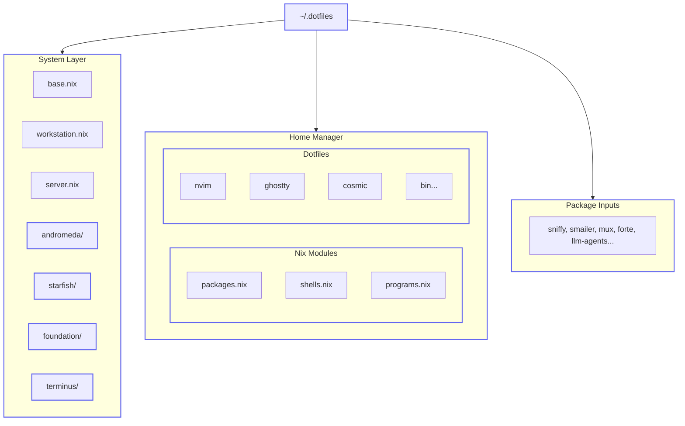

# dotfiles

NixOS configurations and Home Manager setup for multiple machines across Linux and macOS, managed as a single Nix flake. Everything from system-level services to shell aliases lives here, declaratively defined and reproducible.

## Architecture

The flake produces four NixOS system configurations and Home Manager user configurations for Linux, macOS, and explicit Linux hosts. All NixOS systems share a common base with host-specific overrides layered on top. The Home Manager configuration uses platform conditionals to work on both `x86_64-linux` and `aarch64-darwin`.


```mermaid
flowchart TD
    FLAKE["flake.nix"]
    BASE["base.nix"]
    WORKSTATION["workstation.nix"]
    SERVER["server.nix"]

    subgraph HOSTS["NixOS Hosts"]
        ANDROMEDA["andromeda"]
        STARFISH["starfish"]
        FOUNDATION["foundation"]
        TERMINUS["terminus"]
    end

    subgraph HM["Home Manager"]
        HM_DEFAULT["william"]
        HM_LINUX["william-linux"]
        HM_DARWIN["william-darwin"]
        HM_HOSTS["william@andromeda, william@foundation, william@starfish, william@terminus"]
    end

    FLAKE --> HOSTS
    FLAKE --> HM
    BASE --> WORKSTATION & SERVER
    WORKSTATION --> ANDROMEDA & STARFISH & FOUNDATION
    SERVER --> TERMINUS
    HM_LINUX -.-> HM_HOSTS
    HM_HOSTS -.-> HOSTS

    classDef box stroke:#6366f1,stroke-width:2px
    class FLAKE,BASE,WORKSTATION,SERVER,HOSTS,HM,ANDROMEDA,STARFISH,FOUNDATION,TERMINUS,HM_DEFAULT,HM_LINUX,HM_DARWIN,HM_HOSTS box
```

### Flake Inputs

| Input | Purpose |
|-------|---------|
| `nixpkgs` | Primary package source |
| `home-manager` | Declarative user environment |
| `nixos-hardware` | Hardware-specific modules (Framework laptop) |
| `flake-parts` | Composable flake structure and per-system outputs |
| `treefmt-nix` | Shared formatter/check wiring for `nix fmt` |
| `stylix` | Shared colour and font theming |
| `nix-index-database` | Prebuilt nix-index database and `comma` integration |
| `pre-commit-hooks` | Git hook management |
| `sniffy` | AWS secrets scanner |
| `smailer` | S3 email viewer |
| `mux` | Herdr session manager |
| `forte` | Desktop music player |
| `llm-agents` | Pi package |

## Repository Structure


```mermaid
flowchart TD
    ROOT["~/.dotfiles"]

    subgraph SYSTEM [System Layer]
        BASE[base.nix]
        WORKSTATION[workstation.nix]
        SERVER[server.nix]
        ANDROMEDA[andromeda/]
        STARFISH[starfish/]
        FOUNDATION[foundation/]
        TERMINUS[terminus/]
    end

    subgraph HOME [Home Manager]
        subgraph MODULES [Nix Modules]
            PKGS[packages.nix]
            SHELLS[shells.nix]
            PROGRAMS[programs.nix]
        end
        subgraph CONFIGS [Dotfiles]
            NVIM[nvim]
            GHOSTTY[ghostty]
            COSMIC[cosmic]
            OTHER[bin...]
        end
    end

    subgraph INPUTS [Package Inputs]
        TOOLS[sniffy, smailer, mux, forte, llm-agents...]
    end

    ROOT --> SYSTEM & HOME & INPUTS

    classDef box stroke:#6366f1,stroke-width:2px
    class ROOT,SYSTEM,HOME,INPUTS,MODULES,CONFIGS,ANDROMEDA,STARFISH,FOUNDATION,TERMINUS box
```

## Hosts

### andromeda - Desktop Workstation

System76 Thelio Major with AMD Threadripper and an NVIDIA RTX 5090. Steam is enabled with firewall rules for local game transfers.

### starfish - Laptop

Dell Precision 5750. Inherits everything from the common configuration with no host-specific overrides.

### foundation - Travel Laptop

Framework 13 AMD AI-300 Series. Uses the `nixos-hardware` module for Framework-specific hardware support (power management, firmware, etc).

### terminus - Beelink NAS / headless host

Headless server role with ZFS media storage, Immich, and Audiobookshelf. Its Home Manager profile also excludes workstation browsers, COSMIC settings, and graphical NetworkManager agents, while retaining Herdr for remote sessions. Desktop, audio, printing, Bluetooth, and workstation Docker configuration are excluded by the server boundary. `system/terminus/storage.nix` declares monthly ZFS scrubs and SMART monitoring. Terminus media is treated as replaceable and has no snapshot or off-host backup policy.

### System Roles

All hosts share `system/modules/base.nix`, which provides boot, locale, Nix, the William user, OpenSSH, Tailscale, NetworkManager, Fish, and base command-line tools.

- `system/modules/workstation.nix` adds COSMIC/X11, PipeWire, CUPS/Avahi, Bluetooth, Docker, fonts, and workstation user groups.
- `system/modules/server.nix` disables documentation and asserts that graphical services remain off.
- Host modules layer hardware, kernel, service, and storage choices on their role.

Operational build, activation, rollback, and Terminus health commands are documented in [NixOS Host Operations](docs/nixos-host-operations.md).

## Home Manager

The user configuration is split into focused modules that are composed in `home/user/default.nix`.

### Packages

Over 100 packages organised by purpose. Platform-specific GUI apps, clipboard tools, and system tracers are conditionally included using `lib.optionals stdenv.isDarwin` / `lib.optionals stdenv.isLinux`.

| Category | Packages | Platform |
|----------|----------|----------|
| **AI** | pi | All |
| **Desktop** | AeroSpace, Brave, Ghostty, Slack, Spotify, Telegram | Darwin |
| **Desktop** | Brave, Chrome, Spotify, Slack, Telegram, LibreOffice, Variety | Linux |
| **Dev Tools** | gh, delta, lazydocker, dive, fzf, ripgrep, fd, jq, yq, httpie | All |
| **Networking** | nmap, mtr, doggo | All |
| **Networking** | tshark, bandwhich, iftop, nload | Linux |
| **Languages** | Node.js, Python 3, Ruby (YJIT), Go, Terraform, Lua | All |
| **LSP Servers** | nil, lua-language-server, gopls, ccls, bash-language-server, marksman, typescript-language-server | All |
| **Monitoring** | btop, htop | All |
| **Databases** | PostgreSQL, Valkey, pgcli | All |
| **Custom** | sniffy, smailer, mux, ecs | All |

### AI / LLM Agent Harness

The LLM harness is deliberately single-source: universal rules, job guides, and job-specific skills live once in `home/config/llm/` and Home Manager expands them into each tool's expected config directories.

- **Universal rules** live in `home/config/llm/AGENTS.md` and are deployed to:
  - `~/.pi/agent/AGENTS.md`
  - `~/.agents/AGENTS.md`

- **Job-specific guides** live in `home/config/llm/guides/` and are deployed to every supported guide root. Shared branch references for PRs, RSpec, and related workflows are wired explicitly from `home/user/llm-harness.nix`.

- **The deployment catalog** in `home/config/llm/skill-catalog.json` owns skill names, classifications and explicit reference mappings. Home Manager and the structural auditor consume the same registry; skill frontmatter still owns runtime/manual-invocation gates.

- **Shared job-specific skills** live in `home/config/llm/skills/` and are deployed to `~/.agents/skills/`. Skill-local `references/` trees are discovered from the filesystem, and per-skill explicit-invocation metadata is preserved when present.

- **Process skills and reference library** live in `home/config/llm/process-skills/` and `home/config/llm/references/`, deployed under `~/.agents/skills/` and `~/.agents/references/` respectively.

- **Router and maintenance helpers** live alongside the harness:
  - `skill-router` is the entry point when an agent or user is unsure which skill applies.
  - `skill-evaluation` defines the audit/review workflow for harness quality.
  - `home/config/llm/scripts/audit-skills` checks structural issues, stale freshness metadata, broken references, and routing gaps.

Pi loads these shared skills on demand and reaches cloud models through its provider configuration.

### Shell

Fish is the default shell with extensive configuration:

- **Abbreviations** for navigation (`cdr`, `cdn`), Rails (`be`, `bx`, `rc`), Terraform (`tf`, `tfi`, `tfa`, `tfp`), Git, and AWS
- **Functions** for fetching `.gitignore` templates and managing dated notes
- **Zoxide** integration for fast directory jumping
- **Environment:** Neovim as editor/pager, YJIT-enabled Ruby, AWS eu-west-2 defaults

### Git

Signed commits with GPG key `BC6DED9479D436F5`. Delta as the diff viewer with the GitHub theme. Histogram diff algorithm, zdiff3 merge conflicts, auto-stash on rebase, and a commit template with JIRA format guidance. LFS enabled.

### Desktop (Linux only)

COSMIC desktop with autotiling, focus-follows-cursor, and active window hints. Panel on the left (XS) with workspaces and status applets. Six static workspaces with `Super+1-9` switching. All settings managed declaratively via Home Manager.

### Neovim

Single `init.lua` configuration. Leader key is comma. Key mappings include `jk` for escape, JIRA ticket insertion from branch names, and quickfix list toggling.

Stylix owns Neovim's colour scheme through the shared Rose Pine Base16 palette. For this repository, Conform delegates formatting to `nix fmt` so save-on-format follows the same treefmt configuration as pre-commit and CI checks.

### Ghostty

JetBrains Mono font, Catppuccin Mocha theme, slight transparency, 10K line scrollback, and a collection of custom GLSL shaders.

## Package Inputs And Overlays

Personal tools and agent CLIs are exposed through flake inputs and package overlays:

| Package | Source | Reason | Platform |
|---------|--------|--------|----------|
| `pi` | `llm-agents` flake input | Agent tooling | Mixed |
| `sniffy`, `smailer`, `mux`, `forte` | GitHub flake inputs | Personal tools | Mixed |

## Custom Scripts

Located in `home/config/bin/` and added to `$PATH`:

| Script | Purpose |
|--------|---------|
| `notes` / `notes_on` | Fzf-based note browser and dated note creator with templates |
| `gcall` | Nix garbage collection for user and root stores |

## Usage

Rebuild a NixOS system:

```bash
sudo nixos-rebuild switch --flake .#andromeda   # desktop
sudo nixos-rebuild switch --flake .#starfish    # dell laptop
sudo nixos-rebuild switch --flake .#foundation  # framework laptop
sudo nixos-rebuild switch --flake .#terminus    # beelink nas / headless
```

Rebuild the Home Manager configuration:

```bash
hmswitch                                                # Selects this host automatically
nh home switch . --configuration william-linux         # Linux via nh
home-manager switch --flake .#william-linux            # Linux direct
home-manager switch --flake .#william-darwin           # macOS direct
home-manager switch --flake ".#william@$(hostname)"    # explicit Linux host attr
```

Update all flake inputs:

```bash
nix flake update
```

Format and verify the repository:

```bash
nix fmt -- --ci
nix flake check -L
python3 home/config/llm/scripts/audit-skills
nix build --no-link .#homeConfigurations.william-linux.activationPackage
direnv exec . python3 scripts/check-behavior.py "$(nix eval --raw .#homeConfigurations.william-linux.activationPackage.outPath)"
# Realise each NixOS host, matching the Linux CI matrix.
for host in andromeda starfish foundation terminus; do
  nix build -L ".#nixosConfigurations.${host}.config.system.build.toplevel" --no-link
done
```

`flake-parts` owns the per-system outputs in `flake.nix`, so new formatter, check, package, app, and dev shell outputs should usually be added under `perSystem`.

## Pre-commit Hooks

Managed inline in `flake.nix` through `git-hooks.nix` and available in the dev shell (`nix develop`). Formatting is intentionally centralised through treefmt: `nix fmt`, pre-commit, and Neovim all use the same formatter path for this repository.

- **actionlint** - GitHub Actions workflow linting
- **check-added-large-files** - Prevent unexpectedly large files from being committed
- **check-case-conflicts** - Detect filename case conflicts
- **check-json** - JSON syntax validation
- **check-merge-conflicts** - Detect unresolved merge conflict markers
- **check-yaml** - YAML syntax validation
- **deadnix** - Detect unused Nix code
- **detect-private-keys** - Prevent private keys from being committed
- **eclint** - EditorConfig validation
- **end-of-file-fixer** - Ensure files end with a newline
- **fish-syntax** - Fish script syntax validation for custom scripts
- **nil** - Nix language linting
- **treefmt** - Shared formatting for Nix, Lua, shell, Fish, JSON, and YAML
- **shellcheck** - Shell script linting
- **statix** - Nix anti-pattern linting with the repository warning policy
- **trim-trailing-whitespace** - Clean up trailing spaces
