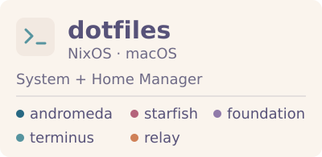

# 

[Hosts and homes](#hosts-and-roles) · [Commands](#what-to-run) · [Checks](#checks-and-maintenance) · [Runbooks](#where-to-go-next)

A Nix flake for William's NixOS workstations and NAS, a headless macOS node, and Home Manager environments. System configuration and user configuration are separate outputs; selecting the right home matters as much as selecting the right host.

- **Another user's machine:** start with the [public Home Manager installer](docs/public-install.md), not a named owner configuration.
- **William's existing machines:** choose the host below, then follow [NixOS host operations](docs/nixos-host-operations.md) or [headless macOS operations](docs/headless-darwin.md).

## Architecture

[flake.nix](flake.nix) composes two platforms: `x86_64-linux` and `aarch64-darwin`.

```text
flake.nix
├── system/
│   ├── modules/base.nix          Shared NixOS foundation
│   ├── modules/workstation.nix   Base + graphical services
│   ├── modules/server.nix        Base + headless assertions
│   ├── <host>/                   NixOS hardware, storage and services
│   └── darwin/                   Relay's nix-darwin system services
└── home/
    ├── default.nix               Home Manager entry point and identity defaults
    ├── private.nix               Owner secret groups and agent-bus integration
    ├── user/                     Packages, programs, shell and service modules
    └── config/                   Managed configuration, scripts and LLM harness
```

### System and home boundaries

- **NixOS:** all four hosts inherit [base.nix](system/modules/base.nix), including boot, locale, Nix, the William account, Fish, NetworkManager, OpenSSH and Tailscale. The [workstation role](system/modules/workstation.nix) adds Hyprland, audio, printing, Bluetooth and Docker. The [server role](system/modules/server.nix) omits that layer and asserts that the display manager, X server and graphical boot remain disabled.
- **macOS:** [system/darwin/](system/darwin/) manages headless system jobs through nix-darwin. Home Manager supplies their user configuration. Relay's system pins its matching home generation, so changes must deploy as a pair. This is not a macOS installer.
- **Home Manager:** [home/user/default.nix](home/user/default.nix) composes the user modules. [capabilities.nix](home/user/capabilities.nix) assigns `workstation`, `automation`, `nas` or `legacy` roles, controlling packages, integrations and services separately from hardware configuration.
- **Public/private:** public homes include the shared modules without owner integrations. Owner homes additionally import the private `nix-config` and `agent-bus` inputs and `home/private.nix`. Named owner systems and homes require authenticated input access; they are not portable installation defaults. Keep credentials out of Nix expressions and the store.

### Other flake outputs

- `lib.mkHome` constructs a home for a supplied identity and is public by default. `homeModules.default` exposes the public module composition for reuse. See [public installation and reuse](docs/public-install.md).
- `overlays.default` supplies the repository's tool packages and selected overrides to NixOS and Home Manager. It is distinct from the exported `packages` set.
- `packages.<system>` exposes `activation-dbus`, `private-access-probe`, `mcp-dap-server` and generated `theme-*` packages. No `apps` output is declared.
- `checks.<system>` covers public/private and host-profile boundaries, headless Darwin, Pi agent-bus composition/runtime, and commit hooks. Platform-specific checks cover the Linux greeter and Darwin headless browser.
- `formatter.<system>` uses treefmt. `devShells.<system>.default` supplies local checks and test tools and installs commit hooks. These per-platform outputs are wired under `perSystem` in `flake.nix`.

## Hosts and roles

NixOS system attributes below live under `nixosConfigurations`; Relay lives under `darwinConfigurations`. Home attributes live under `homeConfigurations`.

| Host / system attribute | Machine and system role | Home attribute / role |
| --- | --- | --- |
| **andromeda** | Thelio Major Threadripper workstation; System76 support and NVIDIA RTX 5090 configuration | `william@andromeda`<br>`workstation` |
| **starfish** | Dell Precision 5750 workstation; host-specific hardware and filesystem configuration | `william@starfish`<br>`legacy` |
| **foundation** | Framework 13 AMD AI-300 workstation; nixos-hardware support and patched MT7925 driver | `william@foundation`<br>`workstation` |
| **terminus** | Beelink headless NAS; ZFS media storage, Immich, Audiobookshelf and Pi Switchboard hub | `william@terminus`<br>`nas` |
| **relay** | Apple Silicon headless macOS automation node | `william@relay`<br>`automation` |

`legacy` preserves the full workstation capabilities for Starfish and generic Linux homes. Terminus excludes desktop configuration and work integrations while retaining maintenance and NAS tools. Relay uses headless browser automation rather than the workstation desktop profile.

Terminus receives `immichPkgs` from the locked unstable input for Immich; its main package set remains on the release input. Foundation receives `nixos-hardware` through its host special arguments. Host-specific services and hardware live in [system/](system/); do not substitute another host's configuration.

### Homes without a host-qualified name

| Home attribute | Intended use |
| --- | --- |
| `laptop` | Public reference identity, not the current user. The installer supplies the actual username, home and checkout paths. |
| `william-linux` | Generic owner Linux home, with the `legacy` role. |
| `william` | Alias of `william-linux`, not automatic platform detection. Avoid it on macOS. |
| `william-darwin` | Alias of Relay's automation home, not a generic macOS desktop profile. |

## What to run

### Public Home Manager installation

Use an existing normal account with Git, Bash and working Nix. The isolated installation test targets x86_64 Linux. This installs user configuration, not NixOS, disks, graphics drivers or system services. Review the [prerequisites and recovery notes](docs/public-install.md) before adopting it over a customised home.

```bash
git clone https://github.com/willfish/nix.git ~/.dotfiles
cd ~/.dotfiles
bash scripts/install-home --public --dry  # Build only; skip private-access detection
```

**Activation changes the current user's managed files and settings.** Run without `sudo`:

```bash
bash scripts/install-home --public
```

Without `--public`, the installer enables private composition only after SSH-derived secret decryption and access to the required private inputs succeed. After installation, `hmswitch` remembers the checkout location. Pi needs the new user's own provider credentials.

### Build an owner configuration without activation

Run from this checkout in its dev environment, using `direnv exec .` as below or an already active `nix develop` shell. Owner commands require private input access. Build on the target platform or a suitable native builder.

```bash
# NixOS: replace foundation with the selected NixOS host from the table.
direnv exec . nix build --no-link .#nixosConfigurations.foundation.config.system.build.toplevel

# Home Manager: choose the host-qualified home, especially for Terminus.
direnv exec . nix build --no-link '.#homeConfigurations."william@foundation".activationPackage'

# Relay: run on native macOS; the system pins its matching home generation.
direnv exec . nix build --no-link .#darwinConfigurations.relay.system
```

### Activate an existing owner host

> [!WARNING]
> **These commands change the running host or home.** Build first and follow the relevant runbook's preflight and recovery steps.

On the selected NixOS host, from this checkout:

```bash
nh os test .    # Activate temporarily, without changing the boot default
nh os switch .  # Make the system generation persistent, after smoke checks
```

For Home Manager, prefer the installed wrapper:

```bash
hmswitch
```

It selects a known Linux host's `william@<host>` home, falling back to `william-linux`. On Relay after the initial handover, it builds and deploys the matching Darwin system before activating that system's exact home generation; sudo may prompt. Use [headless macOS operations](docs/headless-darwin.md) for first handover, native SSH access and recovery. `hmswitch --dry` previews the Relay pair without activation.

If invoking `nh` directly on Linux, pass the flake path and configuration separately, for example `nh home switch . --configuration william@foundation`. Do not use `nh home switch '.#william-darwin'`, or bypass Relay's paired deployment with a standalone home switch.

For routine read-only health reports, [Justfile](Justfile) provides `just health` for reachable known hosts and `just health terminus` for one host. `just terminus-health` adds detailed ZFS/SMART checks and may prompt for sudo.

## Checks and maintenance

There is **no CI workflow in this checkout**. Local commit hooks are not host builds, and pushes do not build NixOS or Home Manager configurations.

For owner repository checks:

```bash
direnv exec . nix fmt -- --ci
direnv exec . nix flake check -L
```

These do not replace native host builds or runtime checks. [tests/](tests/) contains Nix boundary checks, Python, Node/TypeScript and Bats suites, plus the public clean-install test. [scripts/check-behavior.py](scripts/check-behavior.py) runs the offline behavioral gate against a built immutable home generation; live integrations need separate checks. Follow [host operations](docs/nixos-host-operations.md) for the commands and coverage boundaries. Public installers should use the narrower checks in [public-install.md](docs/public-install.md), because root-wide flake commands can fetch owner inputs.

Follow [AGENTS.md](AGENTS.md) when changing this repository: do not create branches unless explicitly instructed, and fast-forward any authorized branch into `master` before pushing. Build, activate and verify affected configurations before committing module changes, subject to authorization. Use `hmswitch` for home activation.

## Where to go next

| Task | Documentation |
| --- | --- |
| Install or reuse the public home | [Public install](docs/public-install.md) |
| Build, activate, roll back or check NixOS and Terminus services | [NixOS host operations](docs/nixos-host-operations.md) |
| Provision or operate Relay's paired system and home | [Headless macOS](docs/headless-darwin.md) |
| Configure the desktop, login or recovery | [Hyprland](docs/hyprland.md) |
| Change shared themes and fonts | [Appearance](docs/appearance.md) |
| Use Pi's coding workflow | [Pi workflow](docs/pi-workflow.md) |
| Configure Pi's MCP integration | [Pi MCP](docs/pi-mcp.md) |
| Operate local models | [Local LLM](docs/local-llm.md) |

Shared agent rules, guides and skills live under [home/config/llm/](home/config/llm/); [home/user/llm-harness.nix](home/user/llm-harness.nix) wires their deployment. Edit maintained source rather than generated files in the home directory.
