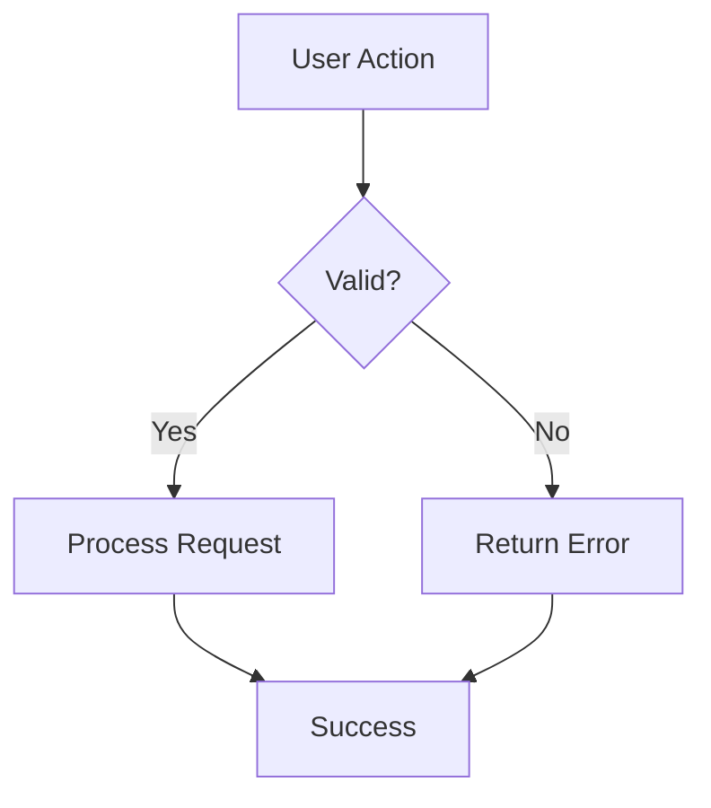
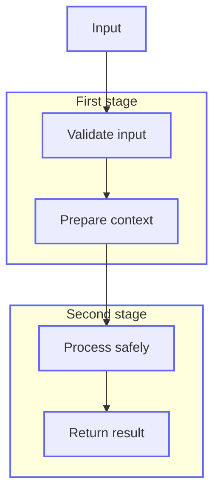

# Mermaid on GitHub - Tips & Gotchas

GitHub's Mermaid renderer is convenient but has several limitations.

## Common Problems

- **Parentheses in labels**: Using unescaped `(` or `)` inside node labels (e.g. `Node[william (Linux)]`) causes parse errors on GitHub.
  **Recommended fix**: Use HTML entities (cleanest result on GitHub):
`Node["william &#40;Linux&#41;"]` → renders as **william (Linux)** with no visible escape characters.

- **Subgraphs**: Deep nesting (more than 1-2 levels) often produces ugly or broken layouts.
- **HTML in nodes**: Using ` `, `<b>`, or `<i>` inside node labels frequently causes rendering bugs or overflow.
- **Dark mode**: Text color contrast can become unreadable. Avoid relying on light colors.
- **Direction**: `flowchart LR` (left-right) often looks worse than `TD` (top-down) on wide diagrams.
- **Custom themes**: The `%%{init: { ... }}` block is only partially supported.

## Recommended Patterns

**Good:**

**Better for complex flows** — Split into multiple smaller diagrams instead of one giant one.

**Preferred PR style:**

Use GitHub's default Mermaid theme and add one light shared outline class. This gives diagrams a cleaner, deliberate look without relying on fragile custom theme blocks.

Use this pattern for small PR diagrams:

- Use `flowchart TD`.
- Group related steps with shallow `subgraph` blocks.
- Keep node labels short and readable.
- Use uppercase node IDs and clear prose labels.
- Add one shared `classDef box stroke:#6366f1,stroke-width:2px`.
- Apply the class to visible nodes and subgraphs.
- Avoid `%%{init}` theme blocks in PR diagrams; GitHub only partially supports them and they can hurt dark mode.

## When to Abandon Inline Mermaid

If your diagram:
- Has more than ~8-10 nodes
- Needs to be referenced from multiple documents
- Must look identical in light and dark mode
- Is part of long-term architecture documentation

...then **commit an SVG** instead (generated from D2, Mermaid CLI, or Excalidraw).

## Pro Tips

- Use `TD` direction by default for architecture.
- Keep node labels under 4-5 words.
- Use a legend node rather than trying to encode everything in colors.
- Test the diagram by viewing the PR in both light and dark mode before requesting review.
