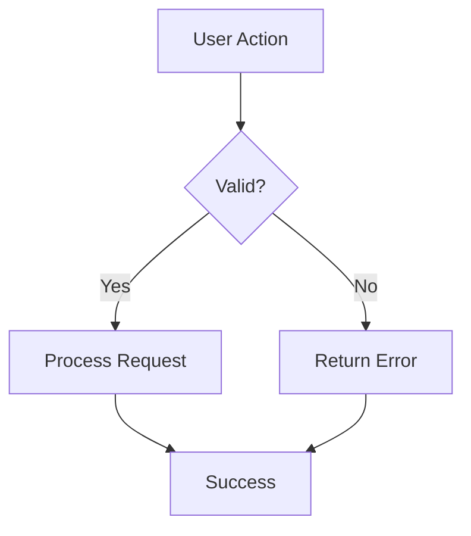

# Mermaid on GitHub - Tips & Gotchas

GitHub's Mermaid renderer is convenient but has several limitations.

## Common Problems

- **Subgraphs**: Deep nesting (more than 1-2 levels) often produces ugly or broken layouts.
- **HTML in nodes**: Using ` `, `<b>`, or `<i>` inside node labels frequently causes rendering bugs or overflow.
- **Dark mode**: Text color contrast can become unreadable. Avoid relying on light colors.
- **Direction**: `flowchart LR` (left-right) often looks worse than `TD` (top-down) on wide diagrams.
- **Custom themes**: The `%%{init: { ... }}` block is only partially supported.

## Recommended Patterns

**Good:**

**Better for complex flows** — Split into multiple smaller diagrams instead of one giant one.

## When to Abandon Inline Mermaid

If your diagram:
- Has more than ~8-10 nodes
- Needs to be referenced from multiple documents
- Must look identical in light and dark mode
- Is part of long-term architecture documentation

...then **commit an SVG** instead (generated from D2, Mermaid CLI, or Excalidraw).

## Pro Tips

- Use `TD` direction by default for architecture.
- Keep node labels under 4-5 words.
- Use a legend node rather than trying to encode everything in colors.
- Test the diagram by viewing the PR in both light and dark mode before requesting review.