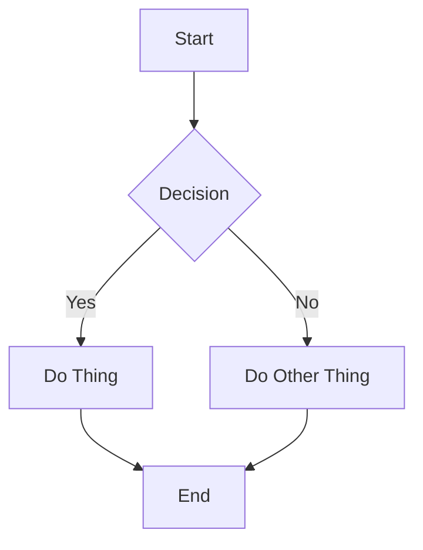

# Diagramming Best Practices

Use this guide whenever you need to create or improve diagrams for documentation, architecture discussions, PRs, GitHub issues, or design docs.

## Tool Selection

| Tool              | Best For                              | GitHub Rendering      | Dark Mode | Recommendation |
|-------------------|---------------------------------------|-----------------------|-----------|----------------|
| **Inline Mermaid** | Quick sequence, simple flowcharts    | Good (with caveats)   | Okay      | Use for small diagrams in PR descriptions |
| **D2**            | Complex architecture, layered systems | Via committed SVG     | Excellent | Preferred for serious architecture work |
| **Excalidraw**    | Hand-drawn / exploratory diagrams    | Committed SVG         | Good      | Great for early design discussions |
| **Committed SVG** | Anything that must look perfect      | Perfect               | Perfect   | Default for important architecture diagrams |
| **PlantUML**      | UML-heavy systems                    | Committed SVG         | Good      | Rarely needed |

**Rule of thumb:**
- If the diagram will live in a PR description or GitHub issue → start with Mermaid or D2 → commit as SVG if it becomes important.
- If it's architecture that multiple people will refer to over time → use D2 and commit the `.d2` source + rendered SVG.

## GitHub Mermaid Limitations & Workarounds

GitHub's Mermaid renderer has several annoying limitations:

- Subgraph nesting > 1 level deep often looks terrible.
- Long labels with ` ` or HTML frequently cause layout breakage.
- Dark mode support is inconsistent (text can become unreadable).
- Custom `%%{init}` theme blocks are partially ignored.

**Better patterns on GitHub:**

- Prefer `TD` (top-down) over `LR` for most architecture diagrams.
- Keep node text short. Use a legend instead of cramming everything into one box.
- Avoid heavy use of `<b>`, `<i>`, and ` ` inside nodes.
- Test diagrams in both light and dark mode before putting them in a PR.

## When to Commit an SVG Instead of Using Inline Mermaid

Commit an SVG (and preferably the source) when:

- The diagram is referenced from multiple places (README, multiple docs, architecture decision records).
- It is complex enough that Mermaid rendering becomes unreliable.
- You care about consistent appearance across light/dark mode and different viewers.
- The diagram is part of the permanent project documentation.

Recommended workflow:
1. Create the diagram in D2 or Excalidraw.
2. Export clean SVG.
3. Commit both the source (`.d2` or `.excalidraw`) and the `.svg`.
4. Reference the SVG in Markdown with ``.

## Diagram Quality Guidelines

- **One diagram, one purpose.** Don't try to show everything in one giant diagram.
- **Use levels of abstraction.** High-level context diagram → mid-level component diagram → detailed sequence/flow when needed.
- **Consistent direction.** Most architecture diagrams read better top-to-bottom (`TD`) or left-to-right (`LR`). Pick one and stick to it.
- **Avoid deep nesting.** Two levels of grouping is usually the maximum that remains readable.
- **Label relationships**, not just boxes.
- **Use color sparingly** and with meaning (e.g., green = external, blue = our services, orange = data stores).

## Integration with PRs and GitHub Work

When working on a PR that involves architecture or significant behavior changes:

- Consider whether a diagram would make the "Why?" section clearer.
- If you create a diagram, prefer committing it as an SVG in a `docs/` or `architecture/` folder.
- Update the PR description to reference the new diagram.
- In code review, use the `diagramming` skill (or this guide) to give feedback on diagram clarity.

The `pull-request-workflow` and `hmrc-trade-tariff-workflow` skills both reference this guide when diagrams are relevant.

## Related Skills

- `pull-request-workflow` — when deciding whether and how to include diagrams in PRs.
- `hmrc-trade-tariff-workflow` — for architecture work on the trade-tariff stack.
- `code-review-workflow` — when reviewing diagrams submitted in PRs.