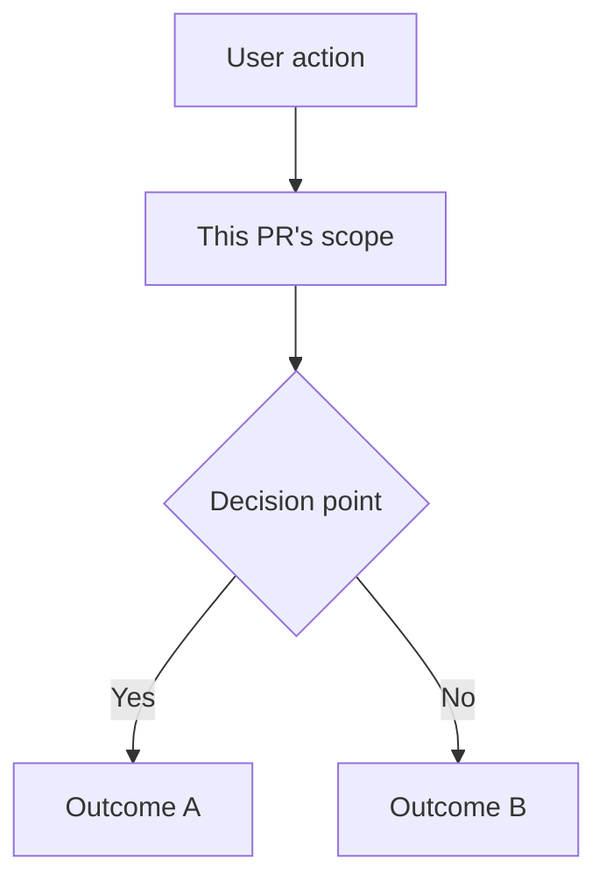

# PR Diagrams

Before drafting or updating prose, read `~/.agents/guides/documentation-relevance.md`; retain detail only when it serves this artifact's reader and purpose.

Use this when adding diagrams to pull request descriptions.

Add a Mermaid diagram only when it makes scope or complex flow easier to
understand than prose alone. Being part of a larger feature is not sufficient.

Place the diagram between the Jira link and the What section:

````markdown
### Jira link

[PROJ-154](https://issues.example.com/browse/PROJ-154)



### What?
````

Keep diagrams simple. Show the high-level flow, not implementation details.
Reviewers should understand the context at a glance.

When adding Mermaid, use the `diagramming` skill for GitHub rendering
constraints and preferred inline Mermaid style.
